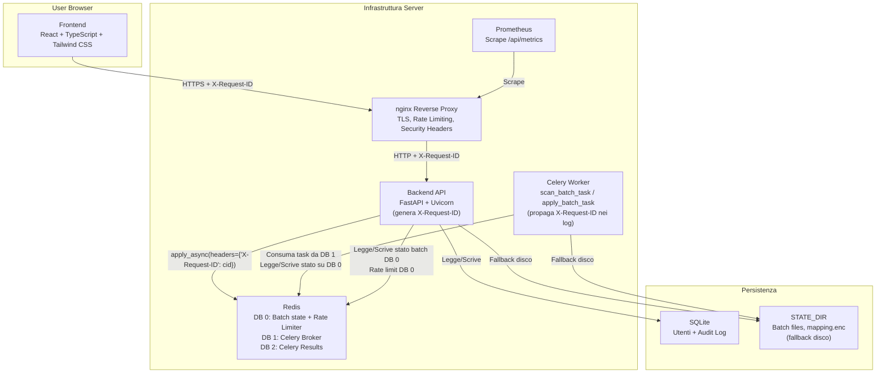

# Local Pseudonymization Tool v5.2.1

[](https://www.python.org/downloads/) [](https://react.dev) [](https://fastapi.tiangolo.com) [](https://opensource.org/licenses/MIT)
[](backend/tests/) [](backend/tests/) [](#-monitoring-prometheus)

Web application locale moderna per la pseudonimizzazione sicura di dati sensibili in documenti di testo, DOCX, XLSX, PDF e immagini. Interfaccia React con TypeScript e Tailwind CSS, dark mode supportato. Progettato per ambienti enterprise che richiedono massima sicurezza e capacità di operare completamente offline.

🔗 **Repository:** [github.com/3n1gm496/pseudonymization-tool](https://github.com/3n1gm496/pseudonymization-tool)

## ✨ Caratteristiche

- **🔒 100% Offline** — Nessuna chiamata di rete esterna, tutti i dati rimangono sulla macchina locale
- **📄 Multi-formato** — Supporto per TXT, CSV, MD, DOCX, XLSX, PDF (testuali), JPG, PNG
- **🔐 Sicurezza Avanzata** — Mapping cifrato con passphrase AES-256-GCM, zero logging di dati sensibili
- **👥 Autenticazione Ibrida** — Supporto per login locale (SQLite + bcrypt) e aziendale (LDAP eDirectory), con ruoli `admin` e `operator` mappabili da gruppi LDAP. La scelta del metodo avviene esplicitamente nella pagina di login.
- **⚡ Notifiche Real-time** — Aggiornamenti di stato in tempo reale via Server-Sent Events (SSE) con fallback automatico a polling.
- **🚀 Architettura Asincrona** — Elaborazione con Celery + Redis; stato batch condiviso su Redis DB 0 + disco, scalabile e resiliente
- **🔗 Distributed Tracing** — `X-Request-ID` propagato da ogni request HTTP fino ai log del Celery worker per correlazione end-to-end
- **⚙️ Modalità Flessibili** — `light` (solo entità di rete) e `strict` (tutte le entità PII)
- **🧭 Input Unificato** — Testo inline e upload documenti disponibili nello stesso flusso
- **🛡️ Preset Policy** — Profilo `SOC Logs` applicato automaticamente (massima copertura: rete, identità, path)
- **👁️ Review Manuale** — Interfaccia per rivedere e approvare/rifiutare ogni pseudonimo proposto
- **📊 Report Dettagliati** — HTML navigabile e JSON strutturato per audit trail
- **📋 Audit Log** — Log persistente su SQLite di tutte le operazioni, consultabile dall'interfaccia admin
- **✅ Readiness API** — Endpoint `/api/ready` per distinguere processo attivo da servizio pronto
- **🎯 Deterministico** — Stesso input = stesso output con la stessa passphrase
- **🔍 Arricchimento Dati LDAP** — Aumenta l'accuratezza del rilevamento PII usando un server LDAP come fonte dati contestuale per nomi e account aziendali.

---

## 📋 Indice

- [Architettura](#-architettura)
- [Quick Start](#-quick-start)
- [Deployment in Produzione](#-deployment-in-produzione)
- [Monitoring (Prometheus)](#-monitoring-prometheus)
- [Configurazione](#-configurazione)
- [Utilizzo](#-utilizzo)
- [Integrazione AI](#-integrazione-con-ai)
- [Documentazione](#-documentation-guide)
- [Sicurezza](#-sicurezza-e-limitazioni)
- [Sviluppo](#-sviluppo)
- [Contributing](#-contributing)
- [Licenza](#-licenza)

---

## 🏗️ Architettura

### High-Level Overview



### Architettura Asincrona (Celery + Redis)

**🎯 Obiettivo:** Elaborazione asincrona per scan e apply di lunga durata, evitando timeout HTTP. Stato batch condiviso tra API e worker tramite Redis (DB 0) con fallback su disco.

**Componenti:**

1. **Celery Workers** — processano task in background
   - `scan_batch_task`: parsing file + detection PII → stato `REVIEW`
   - `apply_batch_task`: trasformazione + ZIP output → stato `DONE`
   - Retry automatico su errori transienti (`RecoverableError`, `IOError`, `OSError`) fino a 3 volte con exponential backoff
   - Errori critici (`CriticalError`, `ValueError`) falliscono immediatamente senza retry

2. **Redis (3 DB separati)**
   - **DB 0**: stato batch condiviso API ↔ worker (via `batch_manager.py`) + rate limiter sliding-window
   - **DB 1**: Celery broker (task queue `pseudonymization`)
   - **DB 2**: Celery result backend (`celery-task-meta-*`)

3. **Distributed Tracing (X-Request-ID)**
   ```
   Browser/client                FastAPI                   Celery Worker
       │                            │                           │
       │── POST /api/batches ──────>│                           │
       │   X-Request-ID: abc-123    │                           │
       │                            │── apply_async( ──────────>│
       │                            │   headers={               │ log: [cid:abc-123] Scan starting...
       │                            │   'X-Request-ID':'abc-123'│ log: [cid:abc-123] Scan completed
       │<── 202 Accepted ──────────│   })                      │
       │   X-Request-ID: abc-123    │                           │
       │   correlation_id: abc-123  │                           │
   ```
   - Il middleware in `main.py` genera un UUID se il client non invia `X-Request-ID`
   - L'ID è propagato come Celery task header (`apply_async(headers=...)`)
   - Il worker lo estrae da `self.request.headers` e lo prefissa ai log: `[cid:abc-123]`
   - La risposta 202 include `correlation_id` per permettere al client di correlare i propri log

4. **API Pattern (202 Accepted + SSE)**:
   ```
   POST /api/batches → 202 Accepted + {task_id, correlation_id}
   GET /api/batches/{id}/events → text/event-stream (SSE, aggiornamenti push)
   GET /api/batches/{id}/status → {status, progress} (polling fallback lightweight)
   ```
   Il frontend si connette all'endpoint SSE (`EventSource`) per aggiornamenti in tempo reale.
   In caso di disconnessione, il fallback automatico al polling garantisce continuità.

5. **Batch State Lifecycle**:
   ```
   PENDING → SCANNING → REVIEW → APPLYING → DONE
                                           ↘ DONE_WITH_ERRORS
   (qualsiasi stato) → ERROR (su eccezione non recuperabile)
   ```

**🔧 Deployment Modes:**

- **Docker Compose** (raccomandato): All-in-one con Redis + Celery worker
- **Local Dev**: Celery EAGER mode (task sincroni, no Redis)
- **Production**: Multiple workers, Redis cluster, monitoring con Flower (`--profile monitoring`)

Vedi [docs/02_Technical_Architecture.md](docs/02_Technical_Architecture.md) per dettagli completi.

---

## ⚡ Quick Start

### Metodo 1: Docker (Raccomandato)

**Prerequisiti**: Docker e Docker Compose installati

```bash
# Clone del repository
git clone https://github.com/3n1gm496/pseudonymization-tool.git
cd pseudonymization-tool

# 1. Crea il file .env a partire dall'esempio (OBBLIGATORIO)
cp .env.example .env

# 2. Popola .env con valori sicuri (le password sono obbligatorie)
echo "AUTH_PASSWORD=$(openssl rand -base64 24)" >> .env
echo "REDIS_PASSWORD=$(openssl rand -base64 24)" >> .env
echo "AUTH_SECRET=$(openssl rand -base64 48)" >> .env
echo "FLOWER_USER=admin" >> .env
echo "FLOWER_PASSWORD=$(openssl rand -base64 24)" >> .env

# 3. Avvio con Docker
make start
```

> **Nota:** Il file `.env` contiene credenziali sensibili e non deve mai essere committato. È già incluso nel `.gitignore`.

**Servizi avviati:**
- `backend`: FastAPI app (porta 8000)
- `redis`: Message broker (porta interna, non esposta sull'host)
- `celery-worker`: Background task processor

Accedi all'interfaccia: **http://localhost:8000**

> **Primo accesso:** Al primo avvio viene creato automaticamente un utente `admin` con password generata casualmente, visibile nei log di avvio (`make logs`). Cambiare la password immediatamente tramite **Impostazioni → Utenti**.

**Comandi utili:**
```bash
make logs       # Visualizza i log
make stop       # Ferma il servizio
make health     # Verifica lo stato
make monitoring # Avvia con Flower UI su http://localhost:5555
```

Vedi [Makefile](Makefile) per tutti i comandi disponibili.

---

### Metodo 2: Installazione Locale (Senza Docker)

**Per ambienti air-gapped o sistemi senza Docker**

Vedi [scripts/legacy/README.md](scripts/legacy/README.md) per istruzioni dettagliate su:
1. Installazione con Python venv
2. Modalità offline (machine senza internet)
3. Preparazione pacchetto wheelhouse
4. Troubleshooting prerequisiti (Python, Tesseract)

**Quick command:**
```bash
make legacy-start
```

---

## 🚀 Deployment in Produzione

Per un ambiente di produzione, è fornito un file `docker-compose.prod.yml` che orchestra il backend insieme a un reverse proxy **nginx**.

**Funzionalità aggiuntive del setup di produzione:**
- **Terminazione TLS/HTTPS**: nginx gestisce i certificati SSL.
- **Security Headers**: Aggiunta automatica di header come `Strict-Transport-Security` e `X-Content-Type-Options`.
- **Rate Limiting a livello IP**: Protezione contro attacchi di forza bruta o DoS.
- **SSE Support**: nginx configurato con `proxy_buffering off` per l'endpoint SSE.
- **Certificati Self-Signed**: Script per generare certificati di sviluppo inclusi.

### Avvio in Produzione

1.  **Configura `.env`**: Assicurati che `DEPLOYMENT_PROFILE` sia impostato su `prod` e che `PROD_FRONTEND_URL` corrisponda al dominio pubblico (es. `https://pseudonymizer.example.com`).

2.  **Genera i certificati**: Per lo sviluppo, puoi usare lo script fornito.
    ```bash
    ./scripts/generate-dev-certs.sh
    ```
    In produzione, sostituisci `nginx/certs/dev.crt` e `nginx/certs/dev.key` con i tuoi certificati firmati da una CA.

3.  **Avvia con il file di produzione:**
    ```bash
    docker compose -f docker-compose.prod.yml up --build -d
    ```

L'applicazione sarà esposta sulla porta **443 (HTTPS)**.

---

## 📊 Monitoring (Prometheus)

L'applicazione espone un endpoint `/api/metrics` in formato Prometheus per il monitoring.

**Metriche principali:**
| Metrica | Tipo | Label | Descrizione |
|---|---|---|---|
| `pseudonymizer_scans_total` | Counter | `preset` | Scansioni completate |
| `pseudonymizer_applies_total` | Counter | — | Apply completati |
| `pseudonymizer_errors_total` | Counter | `status_code`, `endpoint` | Errori HTTP restituiti |
| `pseudonymizer_active_batches` | Gauge | — | Batch attivi in memoria |
| `pseudonymizer_http_requests_total` | Counter | `method`, `endpoint`, `status` | Richieste HTTP totali |
| `pseudonymizer_detector_duration_seconds` | Histogram | `detector_name` | Latenza per singolo detector — identifica bottleneck |
| `pseudonymizer_transformation_duration_seconds` | Histogram | `file_type` | Latenza trasformazione per tipo file (`.docx`, `.pdf`, …) |

L'endpoint è esentato da autenticazione e CSRF per facilitare lo scraping. In produzione, l'accesso a `/api/metrics` dovrebbe essere limitato a livello di rete (es. consentito solo dall'IP del server Prometheus).

---

## ⚙️ Configurazione

La configurazione avviene tramite **variabili d'ambiente**, definite nel file `.env`.

| Variabile | Descrizione | Default |
|---|---|---|
| `DEPLOYMENT_PROFILE` | Profilo di deployment (`dev`, `staging`, `prod`). Controlla CORS, auth, log level. | `prod` |
| `AUTH_ENABLED` | Abilita/disabilita l'autenticazione. | `true` |
| `AUTH_USERNAME` | Username legacy per il fallback admin (usato se `users.db` non esiste). | `admin` |
| `AUTH_PASSWORD` | Password legacy per il fallback admin. | **Obbligatoria** |
| `AUTH_SECRET` | Chiave segreta per la firma dei token di sessione (HMAC). | **Obbligatoria** |
| `REDIS_PASSWORD` | Password per l'accesso a Redis. | **Obbligatoria** |
| `WEB_CONCURRENCY` | Numero di worker Uvicorn. Aumentare solo con Redis abilitato. | `1` |
| `PROD_FRONTEND_URL` | URL pubblico del frontend (per CORS in produzione). | `""` |

La configurazione LDAP (sia per l'arricchimento dati che per l'autenticazione) avviene tramite l'interfaccia web in **Impostazioni → LDAP** ed è salvata nel database persistente. Vedi [docs/RUNBOOK.md](docs/RUNBOOK.md) per la guida alla configurazione LDAP.

---

## 💡 Utilizzo

1. **Login**: Accedi con le credenziali locali oppure, se configurato, con le credenziali aziendali LDAP.
2. **Upload**: Trascina i file da processare nell'area di upload.
3. **Configura**: Inserisci una **passphrase robusta** (essenziale per la sicurezza del mapping). Il profilo di scansione `SOC Logs` viene applicato automaticamente.
4. **Avvia Scansione**: Il backend analizza i file e rileva le entità sensibili. Lo stato avanza in tempo reale via SSE.
5. **Review**: Rivedi i "finding" proposti, approva o modifica gli pseudonimi.
6. **Applica**: Applica le modifiche per generare i file pseudonimizzati.
7. **Risultati**: Nella sezione Results accedi a:
   - **Testo pseudonimizzato** — Copia negli appunti o scarica come .txt
   - **Passphrase visibile** — Mostra/nascondi e copia per l'uso successivo
   - **File mapping.enc** — Scarica il mapping cifrato (essenziale per il revert)
   - **ZIP finale** (per file) — Contiene documenti pseudonimizzati + report.html + report.json + mapping.enc

---

## 🤖 Integrazione con AI

Vuoi inviare i tuoi dati a un modello AI (ChatGPT, Claude, LLaMA) senza esporre informazioni sensibili?

### Workflow

1. **Pseudonimizza i tuoi dati** nel Tool (vedi sezione Utilizzo sopra)
2. **Nella sezione Results:**
   - Copia o scarica il **testo pseudonimizzato**
   - Scarica il file **mapping.enc** (cifrato, essenziale)
   - Copia e salva la **passphrase** (in luogo sicuro)
3. **Invia il testo pseudonimo all'AI** (non inviare mapping.enc o passphrase)
4. **Ricevi la risposta dall'AI** (contiene i tuoi pseudonimi)
5. **Usa il Revert Panel → "Decifra Risposta AI"** per reintegrare i dati originali

### Operazioni Disponibili

**Nel Revert Panel (tab separate):**
- **Decifra Risposta AI** — Decifra il testo pseudonimizzato ricevuto dall'AI usando mapping.enc + passphrase
- **Revert Batch ZIP** — Reversi completamente i file di un batch precedente

### Documentazione Completa

→ Vedi [docs/11_AI_Integration_and_Revert_Flows.md](docs/11_AI_Integration_and_Revert_Flows.md) per:
- Passaggio-per-passaggio del workflow Pseudonimizza → AI → Decifra
- Come scegliere una passphrase robusta
- Operazioni Revert e scenari di utilizzo
- Troubleshooting avanzato

---

## 📚 Documentation Guide

### Per Iniziare
- **[README.md](README.md)** — Questa pagina. Quick start e feature overview.
- **[docs/01_PRD.md](docs/01_PRD.md)** — Product requirements, caso d'uso e stack tecnico.

### Capire l'Architettura
- **[docs/02_Technical_Architecture.md](docs/02_Technical_Architecture.md)** — Architettura backend, flussi, dipendenze moduli, autenticazione ibrida LDAP, SSE.
- **[docs/03_Data_Model.md](docs/03_Data_Model.md)** — Schemi Pydantic e flusso dei dati.
- **[docs/06_Detector_Strategy.md](docs/06_Detector_Strategy.md)** — Strategia di detection (regex, dict, NER, pattern custom).

### Workflow & Usabilità
- **[docs/05_UX_Flow.md](docs/05_UX_Flow.md)** — Flussi utente interfaccia e casi d'uso.
- **[docs/04_Policies.md](docs/04_Policies.md)** — Policy di scansione: profili disponibili (`SOC Logs`, `Policy Docs`, `Email Headers`) e configurazione entità.
- **[docs/11_AI_Integration_and_Revert_Flows.md](docs/11_AI_Integration_and_Revert_Flows.md)** — Integrazione AI, reversibilità, gestione passphrase.

### Testing & Qualità
- **[docs/07_Test_Plan_and_Metrics.md](docs/07_Test_Plan_and_Metrics.md)** — Strategia testing, metriche coverage.
- **[docs/15_CI_Quality_Gates.md](docs/15_CI_Quality_Gates.md)** — Automated quality gates (coverage thresholds, exception patterns).
- **[docs/14_Parser_Capability_Matrix.md](docs/14_Parser_Capability_Matrix.md)** — Feature matrix per parser, limitazioni note.

### Operational & Deployment
- **[docs/08_Risks_and_Mitigations.md](docs/08_Risks_and_Mitigations.md)** — Analisi rischi e mitigazioni.
- **[docs/17_Deployment_Profiles.md](docs/17_Deployment_Profiles.md)** — Profili deployment (DEV, STAGING, PROD), configurazione per ambiente.
- **[docs/18_Deployment_Guide.md](docs/18_Deployment_Guide.md)** — Guida completa al deployment: Docker Compose, Kubernetes, Systemd.
- **[docs/16_Rate_Limit_Robustness.md](docs/16_Rate_Limit_Robustness.md)** — Rate limiting, cleanup auto, memory bounds.
- **[docs/RUNBOOK.md](docs/RUNBOOK.md)** — Runbook operativo: LDAP, SSE, multi-utente, troubleshooting.

### Planning & Roadmap
- **[docs/09_Roadmap.md](docs/09_Roadmap.md)** — Roadmap prodotto.
- **[docs/10_Backlog.md](docs/10_Backlog.md)** — Backlog item e priorità.
- **[docs/RELEASES.md](docs/RELEASES.md)** — Release notes e versioni.
- **[CHANGELOG.md](CHANGELOG.md)** — Changelog dettagliato per versione.

---

## 🔐 Sicurezza e Limitazioni

- **Passphrase**: La sicurezza del mapping dipende dalla robustezza della passphrase. Usane una lunga e complessa (min 12 char, con maiuscole/minuscole/numeri/simboli).
- **Cookie di sessione**: Il backend imposta il cookie auth con flag `Secure` abilitato di default. Solo in sviluppo locale HTTP puoi disabilitarlo esplicitamente con `AUTH_SESSION_COOKIE_SECURE=false`.
- **Gestione Utenti**: Al primo avvio viene creato automaticamente un utente `admin` con password generata casualmente (visibile nei log di avvio). Cambiare la password immediatamente tramite **Impostazioni → Utenti**. Gli utenti `operator` hanno accesso in sola lettura alle impostazioni e non possono gestire altri utenti. Il database utenti è salvato in `STATE_DIR/users.db` (volume persistente Docker).
- **Autenticazione LDAP**: L'autenticazione LDAP usa il bind sull'attributo `cn` dell'oggetto `inetOrgPerson` (compatibile con Novell/NetIQ eDirectory). I ruoli sono determinati dall'appartenenza ai gruppi LDAP configurati. Se il server LDAP non è raggiungibile, solo gli utenti locali possono accedere (fail-safe).
- **TLS LDAP**: In produzione, abilitare `tls_validate_cert` nella configurazione LDAP per prevenire attacchi MITM. Richede un CA bundle valido per il server eDirectory.
- **OCR**: La qualità dell'OCR dipende dalla risoluzione e dalla chiarezza dell'immagine. Testo sfocato o scritto a mano potrebbe non essere rilevato.
- **Formule XLSX**: Le formule vengono ignorate e non pseudonimizzate per evitare di corrompere i fogli di calcolo.
- **Mapping.enc**: Una volta persa la passphrase, il file mapping.enc non è più recuperabile. Conservarlo in un luogo sicuro.

---

## 🛠️ Sviluppo

### Setup Ambiente Sviluppo

```bash
# Crea virtual environment
python3 -m venv .venv  # Python 3.11+ richiesto (3.12 testato in CI)
source .venv/bin/activate  # Linux/macOS
# oppure .venv\Scripts\activate  # Windows

# Installa dipendenze backend
pip install -r backend/requirements.txt
```

### Frontend React + TypeScript

Il frontend è scritto in **React 18**, **TypeScript strict mode**, **Tailwind CSS** e **dark mode**.

#### Setup Frontend

```bash
cd frontend
npm install
```

#### Dev (Vite + HMR)

```bash
# Terminal 1: Backend
cd backend
python -m uvicorn app.main:app --host 127.0.0.1 --port 8000

# Terminal 2: Frontend (Vite dev server)
cd frontend
npm run dev
```

Accedi a: `http://localhost:5173` (con API proxy a backend su `:8000`)

#### Build per Production

```bash
cd frontend
npm run build
```

Crea `frontend/dist/` che FastAPI servirà automaticamente in produzione.

#### Dev Mode (Full Stack)

```bash
make dev
```

Avvia sia backend che frontend in parallelo con HMR (Hot Module Reload). Backend su `:8000`, Frontend su `:5173`.

Alternativamente:
```bash
./scripts/dev-stack.sh
```

#### Caratteristiche Frontend

✨ **UI/UX**
- Dark mode toggle (persiste in localStorage)
- Responsive design mobile-first
- Smooth animations e transitions
- Toast notifications (success, error, warning, info)
- Drag-and-drop file upload

📊 **Workflow**
- Scanner unificato (testo + file)
- Profilo `SOC Logs` applicato automaticamente
- Findings table con review interattivo
- Custom pseudonym personalizzato
- Download ZIP con report (HTML + JSON)
- Notifiche real-time via SSE durante la scansione

🔧 **Tech Stack**
- React 18 con Hooks
- TypeScript strict mode
- Tailwind CSS v3 (dark mode)
- Vite bundler
- Axios per le chiamate API
- Context API per state management

### Testing

**Test Suite Status (v5.2.1):**
- ✅ **803 test backend passanti, 11 skippati** (Python 3.11 e 3.12)
  - `test_functional.py`: detector, parser, sicurezza, crypto
  - `test_auth_complete.py`: suite completa autenticazione locale e JWT
  - `test_ldap_auth.py`: autenticazione LDAP ibrida (39 test, mock eDirectory)
  - `test_csrf_middleware.py`: protezione CSRF globale
  - `test_api_contract.py`: contratti API (202 Accepted pattern)
  - `test_audit.py`: audit log persistente su SQLite
- ✅ **47 test frontend passanti** (vitest)
- 📊 **Coverage backend: 86%** — Moduli critici:
  - `crypto.py`: 95%
  - `schemas.py`: 100%
  - `exceptions.py`: 100%
  - `safety.py`: 92%
  - `ldap_auth.py`: 88%
  - `auth.py`: 79%
  - `pipeline.py`: 73%

**Test Infrastructure:**
- Celery EAGER mode per esecuzione sincrona in test (no broker necessario)
- Redis mocking con fallback in-memory
- LDAP mocking con `unittest.mock` (no server LDAP necessario)
- Test di integrazione multicontainer separati (`pytest -m integration`, richiede Docker)

```bash
# Esegui tutti i test unitari (no Docker necessario)
cd backend
pytest tests/ -m "not integration" -v

# Con coverage report
pytest tests/ -m "not integration" --cov=app --cov-report=html

# Test di integrazione (richiede Docker Compose attivo)
pytest tests/ -m integration -v

# Test frontend
cd frontend
npx vitest run

# Tramite Makefile
make test       # test unitari backend
make test-cov   # con coverage report
```

### Endpoint Operativi

```bash
curl http://127.0.0.1:8000/api/health
curl http://127.0.0.1:8000/api/ready
curl http://127.0.0.1:8000/api/settings/policies
curl http://127.0.0.1:8000/api/settings/policies/SOC%20Logs
curl http://127.0.0.1:8000/api/auth/ldap-status  # Stato connessione LDAP (pubblico)
```

### Struttura Progetto

```
pseudonymization-tool/
├── backend/                    # FastAPI backend
│   ├── app/
│   │   ├── api/               # API routes (/api/*)
│   │   │   ├── auth_routes.py     # Login, logout, ldap-status
│   │   │   ├── batches_routes.py  # Batch processing + SSE events
│   │   │   ├── settings_routes.py # Configurazione LDAP, policy, profili
│   │   │   └── users_routes.py    # Gestione utenti multi-user
│   │   ├── core/              # Business logic
│   │   │   ├── auth.py            # Autenticazione ibrida (locale + LDAP)
│   │   │   ├── ldap_auth.py       # Autenticazione LDAP eDirectory
│   │   │   ├── ldap_client.py     # LDAP detector data enrichment
│   │   │   ├── audit.py           # Audit log persistente SQLite
│   │   │   └── user_manager.py    # Gestione utenti SQLite + bcrypt
│   │   ├── detectors/         # Entity detection (regex, dict, NER, SOC)
│   │   ├── parsers/           # Document parsers (PDF, DOCX, XLSX, IMG)
│   │   ├── pseudonymizer/     # Transformation engine
│   │   ├── mapping/           # Crypto (AES-256-GCM encryption)
│   │   ├── report/            # Report generation (HTML + JSON)
│   │   └── models/            # Pydantic schemas
│   ├── tests/                 # Unit & integration tests (803 test)
│   ├── requirements.txt       # Dipendenze Python
│   └── requirements.lock      # Lock file per build riproducibili
├── frontend/                  # React 18 + TypeScript + Tailwind CSS
│   ├── src/
│   │   ├── components/        # React components (.tsx)
│   │   │   ├── LoginForm.tsx      # Login con scelta metodo locale/LDAP
│   │   │   ├── Scanner.tsx        # Scanner con SSE real-time
│   │   │   ├── LDAPSettings.tsx   # Configurazione LDAP completa
│   │   │   ├── UserManagement.tsx # Gestione utenti admin
│   │   │   ├── AuditLog.tsx       # Visualizzazione audit log
│   │   │   └── ...
│   │   ├── context/           # Context API (ThemeContext)
│   │   ├── hooks/             # Custom hooks (useToast)
│   │   ├── test/              # Test vitest (47 test)
│   │   ├── utils/             # Utility (axios, text-export)
│   │   ├── App.tsx            # Root component
│   │   ├── main.tsx           # Entry point
│   │   └── types.ts           # TypeScript interfaces
│   ├── index.html
│   ├── package.json
│   ├── tsconfig.json
│   └── vite.config.ts
├── nginx/
│   └── nginx.conf             # Reverse proxy con SSE support
├── docs/                      # Documentazione tecnica e operativa
├── scripts/
│   ├── dev-stack.sh           # Development mode helper
│   └── legacy/                # Venv-based startup scripts (air-gapped)
├── .env.example               # Template variabili d'ambiente
├── Makefile                   # Universal command interface
├── docker-compose.yml         # Docker orchestration (dev)
├── docker-compose.prod.yml    # Docker orchestration (produzione con nginx)
├── Dockerfile                 # Multi-stage build
├── CHANGELOG.md               # Changelog dettagliato
└── README.md
```

---

## 🤝 Contributing

Le contribuzioni sono benvenute! Per contribuire:

1. Fork del progetto
2. Crea un branch per la tua feature (`git checkout -b feature/AmazingFeature`)
3. Commit delle modifiche (`git commit -m 'Add some AmazingFeature'`)
4. Push al branch (`git push origin feature/AmazingFeature`)
5. Apri una Pull Request

Leggi la [documentazione tecnica](docs/02_Technical_Architecture.md) per comprendere l'architettura.

---

## 📄 Licenza

Questo progetto è distribuito sotto licenza MIT. Vedi il file `LICENSE` per maggiori dettagli.

---

## 🙏 Riconoscimenti

- **Tesseract OCR** per il riconoscimento ottico dei caratteri
- **FastAPI** per il framework web
- **python-docx, openpyxl, pypdf** per il parsing dei documenti
- **ldap3** per l'integrazione con server LDAP/eDirectory
- Community open source per i contributi e il feedback
