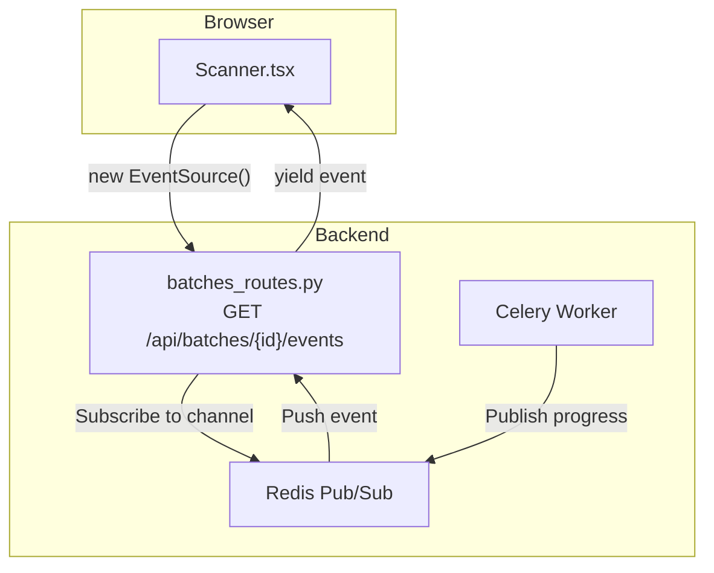
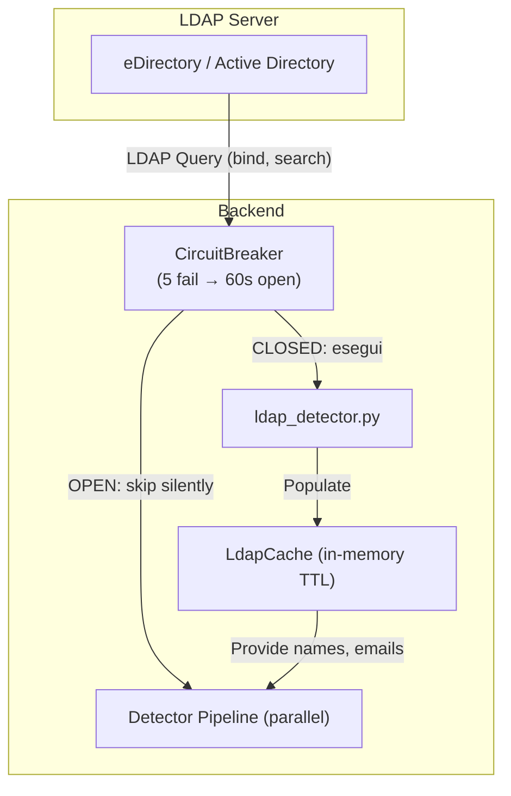

# Architettura Tecnica — Local Pseudonymization Tool

**Versione:** 5.2.1
**Data:** 2026-03-05

---

## 1. Panoramica dell'Architettura

L'applicazione è una **single-page web application (SPA)** con architettura completamenz locale e offline. Sistema client-server con separazione chiara tra:

- **Frontend:** React 18 + Vite (SPA)
- **Backend:** FastAPI (Python 3.12) con Uvicorn
- **Processing:** Moduli Python ortogonali (parsing, detection, pseudonimizzazione, revert)

```
┌─────────────────────────────────────────────────────────┐
│          React 18 + Vite (Frontend SPA)                 │
│  ┌──────────┬──────────┬──────────┬──────────────────┐  │
│  │ Scanner  │ Review   │ Results  │ RevertPanel      │  │
│  │ (S3)     │ (S2)     │ (S3)     │ (Optional)       │  │
│  └──────────┴──────────┴──────────┴──────────────────┘  │
│                        ▼ (fetch API)                    │
├─────────────────────────────────────────────────────────┤
│   FastAPI (Python 3.12.3) - Server ASGI                 │
│  ┌──────────┬─────────┬─────────┬──────────────────┐   │
│  │ Auth     │ Batch   │ Findings│ Revert           │   │
│  │ Routes   │ Routes  │ Routes  │ Routes           │   │
│  └──────────┴─────────┴─────────┴──────────────────┘   │
│                   ▼ orchestration                        │
├─────────────────────────────────────────────────────────┤
│   Processing Pipeline (Modular Design)                  │
│  ┌──────────┬──────────┬──────────┬──────────────────┐  │
│  │ Parser   │ Detector │ Pseudo.  │ Mapping & Report │  │
│  │ Module   │ Module   │ Module   │ Module           │  │
│  └──────────┴──────────┴──────────┴──────────────────┘  │
│                        ▼                                │
│   Filesystem: /tmp/pseudonymizer/{batch_id}/            │
└─────────────────────────────────────────────────────────┘
```

---

## 2. Componenti Dettagliati

### 2.1. Frontend (React 18 + Vite)

**Stack:**
- Framework: `React 18.2.0`
- Build Tool: `Vite` (tree-shaking, fast HMR)
- Styling: `Tailwind CSS 3.3`
- HTTP: `fetch` API standard

**Architettura Componenti:**

1. **Scanner (Fase 1 - SCAN)**
   - Upload file (drag & drop)
   - Policy selection (Light/Strict/Custom)
   - Passphrase input
   - Avvio scansione → Batch ID

2. **FindingsTable (Fase 2 - REVIEW)**
   - Entità trovate (table paginated)
   - Pseudonimo proposto per entity
   - Azioni: accetta/modifica/escudi per finding
   - Real-time pseudonym editing

3. **Results (Fase 3 - RESULTS)**
   - Summary: file, entità, tempo
   - **Passphrase visibile** (con copy button + show/hide)
   - **mapping.enc downloadable** (direct from Results)
   - Output ZIP download
   - Prepare for AI section (encrypted mapping generation)

4. **RevertPanel (Fase 4 - OPTIONAL)**
   - **Tab 1: Decifra Risposta AI** - Decrypt AI responses using passphrase
   - **Tab 2: Revert Batch ZIP** - Full batch reversal (original + mapping)
   - Accessible after Results phase

**Comunicazione:**
- All API calls via REST fetch to `127.0.0.1:8000`
- Request/response validation with schemas
- Error handling + user-friendly messages

### 2.2. Backend (FastAPI + Uvicorn)

**Stack:**
- Runtime: `Python 3.12.3`
- Framework: `FastAPI 0.110+`
- Server: `Uvicorn` (ASGI)
- Binding: `127.0.0.1:8000` (loopback only)

**API Routes:**

```
Health & Status
├─ GET  /health              → Health check
├─ GET  /ready               → Readiness check

Batch Management
├─ POST   /api/batches                          → Create batch, upload files
├─ GET    /api/batches/{batch_id}               → Get batch metadata
├─ POST   /api/batches/{batch_id}/scan          → Start scan pipeline
├─ GET    /api/batches/{batch_id}/findings      → Get detected entities
├─ POST   /api/batches/{batch_id}/review        → Submit review decisions
├─ POST   /api/batches/{batch_id}/apply         → Apply pseudonymization
├─ GET    /api/batches/{batch_id}/download      → Download results ZIP
├─ GET    /api/batches/{batch_id}/events        → SSE stream aggiornamenti stato (text/event-stream)
├─ GET    /api/batches/{batch_id}/status        → Polling status (fallback SSE)
├─ DELETE /api/batches/{batch_id}               → Clean batch

User Management (v5.1+)
├─ GET    /api/users                            → Lista utenti (solo admin)
├─ POST   /api/users                            → Crea utente (solo admin)
├─ GET    /api/users/me                         → Utente corrente (username + ruolo)
├─ GET    /api/users/{username}                 → Dettaglio utente (solo admin)
├─ PUT    /api/users/{username}                 → Aggiorna ruolo/password (solo admin o self)
├─ DELETE /api/users/{username}                 → Elimina utente (solo admin)

Mapping Management (v4.0.4+)
├─ GET    /api/batches/{batch_id}/mapping       → Get encrypted mapping
├─ POST   /api/batches/{batch_id}/decipher      → Decrypt mapping with passphrase

Revert Operations (v4.0.4+)
├─ POST   /api/batches/{batch_id}/revert/text   → Revert single text finding
├─ POST   /api/batches/{batch_id}/revert/batch  → Revert full batch ZIP

Policy Management
├─ GET    /api/policies                         → List policies
├─ GET    /api/policies/{policy_id}/preview     → Preview policy config
```

**Gestione Stato Batch:**
- Stored in `/tmp/pseudonymizer/{batch_id}/`
- Lifecycle: `created` → `scanned` → `reviewed` → `applied`
- Cleanup: Auto-delete after 24h or manual DELETE

### 2.3. Processing Pipeline

5 moduli sequenziali, ortogonali e testabili:

#### 1. Parser Module (`parsers/`)
```
Input: File (docx, pdf, xlsx, txt, png, jpg)
       ↓
[Estensione Check] → [Parser Factory]
       ↓
Parsers:
├─ text_parser.py   → .txt files (readlines)
├─ docx_parser.py   → .docx (python-docx)
├─ pdf_parser.py    → .pdf (pypdf)
├─ xlsx_parser.py   → .xlsx (openpyxl)
├─ image_parser.py  → .png/.jpg (Pillow + Tesseract OCR)
       ↓
Output: {
  "file_name": "doc.pdf",
  "text": "Mario Rossi...",
  "metadata": {"pages": 5, "parsed_at": "2026-03-02T10:30:00Z"}
}
```

#### 2. Detector Module (`detectors/`)

I detector vengono eseguiti **in parallelo** tramite `ThreadPoolExecutor` (max 4 worker) nel `PseudonymizationEngine`. I detector lenti (LDAP, ML) non bloccano quelli veloci (regex, dizionario).

```
Input: Parsed text
       ↓
[PseudonymizationEngine — ThreadPoolExecutor(max_workers=4)]
├─ regex_detectors.py           ─┐
│  ├─ Email: user@domain.it      │ eseguiti
│  ├─ IP: 192.168.1.1            │ in
│  ├─ CF: RSSMRA80A01H501T       │ parallelo
│  ├─ P.IVA: 12345678901         │
│  └─ URL: https://example.com  ─┤
│                                │
├─ dictionary_detector.py       ─┤
│  ├─ person_names.txt           │
│  ├─ project_codes.txt          │
│  └─ hostnames.txt             ─┤
│                                │
├─ ml_ner_detector.py           ─┤  ← protetto da CircuitBreaker
│  └─ spaCy NER (it/en)          │    (5 fail → 60s open)
│     ├─ PER (nomi persona)       │
│     ├─ ORG (organizzazioni)     │
│     └─ LOC (luoghi)            ─┤
│                                │
└─ ldap_detector.py             ─┘  ← protetto da CircuitBreaker
   └─ LdapCache (CN, mail,          (5 fail → 60s open)
      sAMAccountName)
       ↓
[Aggregazione + Deduplicazione (overlap resolution)]
       ↓
Output: [
  Finding(
    value="mario.rossi@ente.gov.it",
    finding_type="EMAIL",
    position={"file": "doc.pdf", "line": 5, "char": 12},
    confidence=0.95,
    context="Dear mario.rossi@ente.gov.it, ..."
  ),
  ...
]
```

#### 3. Pseudonymizer Module (`pseudonymizer/`)
```
Input: Findings + Mode (Light/Strict)
       ↓
transformer.py:
├─ Email    → user_{rand_id}@orgdom_{rand_id}.gov.it
├─ IP       → {rand_octet}.{rand_octet}.{rand_octet}.{rand_octet}
├─ CF       → Random 16-char XXXXXXXXXXX...
├─ P.IVA    → Random 11-digit
├─ Name     → Name_{rand_id}
└─ Generic  → ENTITY_{rand_id}
       ↓
Output: Mapping {
  "mario.rossi@ente.gov.it": "user_3847@orgdom_5621.gov.it",
  "192.168.1.1": "10.42.137.88",
  ...
}
Consistency: All occurrences of same value → same pseudonym within batch
```

#### 4. Review & Transform Module (`pseudonymizer/engine.py`)
```
Input: Findings + User Review Decisions + Mapping
       ↓
For each finding:
├─ ACCEPTED → Use proposed pseudonym
├─ MODIFIED → Use user-provided pseudonym
└─ SKIPPED  → Keep original value
       ↓
Apply string replacements in files
       ↓
Output: Pseudonymized files (*.pseudonymized.ext)
```

#### 5. Mapping & Report Module (`report/`)
```
Input: Final mapping, findings metadata
       ↓
generator.py:
├─ mapping.json (clear) → {original: pseudonym}
│
├─ mapping.enc:
│  ├─ Read passphrase from session
│  ├─ AES-256-GCM encryption (cryptography lib)
│  ├─ Store in BASE64
│  └─ File: mapping.enc (can be downloaded from Results)
│
├─ report.json (statistics)
│  ├─ Files processed: N
│  ├─ Entities found: M
│  ├─ Execution time
│  └─ Batch UUID
│
└─ report.html (human-readable summary)
       ↓
Output: All files packaged in results_{batch_id}.zip
```

### 2.4. Security & Isolation (v4.0.4)

**Network:**
- ✅ Binding: `127.0.0.1:8000` only (no external access)
- ✅ No outbound calls (verified by unit tests)
- ✅ Session management: JWT-like tokens (stored in session store)

**Encryption:**
- passphrase → AES-256-GCM via `cryptography` library
- Symmetric encryption (no private keys needed)
- User supplies passphrase → Session key → mapping.enc encrypted

**File Safety:**
- Temp storage: `/tmp/pseudonymizer/{batch_id}/`
- Auto-cleanup: DELETE batch after 24h (configurable)
- No sensitive data in logs (only metadata)
- Output: ZIP with no original files (only pseudonymized + report + encrypted mapping)

**Revert Flows (v4.0.4+):**
- **Text Revert:** Single finding → Original value using passphrase
- **Batch Revert:** Full ZIP reversal (recreate original using mapping.enc + passphrase)

### 2.5. Multi-User Authentication

Il sistema supporta un modello multi-utente con due ruoli:

| Ruolo | Permessi |
|---|---|
| **admin** | Accesso completo: gestione utenti, impostazioni, audit log, tutte le operazioni batch. |
| **operator** | Accesso operativo: crea/gestisce i propri batch, consultazione audit log in sola lettura. |

**Implementazione:**
- Utenti persistiti su SQLite (`users.db`) con password cifrate in bcrypt.
- Sessioni JWT firmate con `AUTH_SECRET` (obbligatorio, nessun default hardcoded).
- `POST /api/auth/login` accetta `auth_method: local | ldap` — la scelta è esplicita dell'utente.
- Autenticazione LDAP gestita da `ldap_auth.py` (distinto da `ldap_detector.py` che è solo arricchimento dati).
- In caso di fallimento LDAP **non** si fa fallback al login locale (fail-safe).
- Audit log persistente su `audit.db`: tutte le azioni critiche (login, scan, apply, download).

**Endpoint:**
```
GET  /api/auth/ldap-status     → LDAP abilitato (usato dal frontend per mostrare/nascondere l'opzione)
POST /api/auth/login           → { username, password, auth_method }
POST /api/auth/test-auth       → Test connettività LDAP (diagnostica, senza login completo)
GET  /api/users/me             → Utente corrente + ruolo
GET  /api/users                → Lista utenti (solo admin)
POST /api/users                → Crea utente (solo admin)
PUT  /api/users/{username}     → Aggiorna ruolo/password (solo admin o self)
DELETE /api/users/{username}   → Elimina utente (solo admin)
```

### 2.6. Real-time Notifications (SSE)

Per migliorare l'esperienza utente durante le operazioni asincrone di lunga durata, è stato implementato un sistema di notifiche push basato su Server-Sent Events (SSE).

**Architettura:**



**Flusso:**

1. Il frontend apre una connessione SSE all'endpoint `GET /api/batches/{id}/events`.
2. Il backend sottoscrive un canale Redis Pub/Sub dedicato al batch (`batch:{id}:events`).
3. Il Celery worker pubblica aggiornamenti di stato durante l'elaborazione.
4. Il backend riceve gli eventi da Redis e li inoltra al frontend via SSE.
5. Il frontend aggiorna la UI in tempo reale, senza polling.

**Fallback:** in caso di disconnessione SSE, il frontend torna a fare polling su `GET /api/batches/{id}/status`.

### 2.7. Contextual Data Enrichment (LDAP)

Per aumentare l'accuratezza del rilevamento di entità (in particolare `PERSON` e `EMAIL`), il sistema può connettersi opzionalmente a un server LDAP (eDirectory, Active Directory) per costruire un dizionario dinamico di utenti aziendali.

> **Importante:** Questa integrazione è utilizzata **esclusivamente per il rilevamento dei dati** e **non per l'autenticazione degli utenti** (quella è gestita da `ldap_auth.py`).

**Architettura:**



**Flusso:**

1. L'amministratore configura la connessione LDAP tramite le impostazioni (host, port, bind DN, search base).
2. Un thread in background (`ldap-refresh`) si connette a intervalli regolari (default: 60 minuti).
3. Scarica attributi degli utenti: `cn`, `mail`, `sAMAccountName`.
4. I dati vengono memorizzati in `LdapCache` (strutture Set per lookup O(1)).
5. Durante la scansione, il `DetectorPipeline` usa la `LdapCache` come dizionario ad alta priorità.
6. Se il server LDAP non è raggiungibile, il **CircuitBreaker** (`app/core/circuit_breaker.py`) apre il circuito dopo 5 failure consecutive: il detector viene skippato silenziosamente per 60 secondi.

**Sicurezza:** nessun dato LDAP scritto su disco, nessuna password/DN nei log.

---

## 3. Data Model

### Batch
```python
{
  "batch_id": "uuid-1234",
  "created_at": "2026-03-02T10:15:00Z",
  "status": "applied",  # created|scanned|reviewed|applied
  "policy_id": "LIGHT",
  "passphrase": "<hashed>",
  "file_count": 5,
  "findings": [...],
  "mapping": {...},
  "expires_at": "2026-03-03T10:15:00Z"  # 24h TTL
}
```

### Finding
```python
{
  "id": "finding-uuid",
  "value": "mario.rossi@ente.gov.it",
  "finding_type": "EMAIL",
  "file": "document.pdf",
  "position": {"page": 1, "char": 42},
  "confidence": 0.95,
  "context": "Dear mario.rossi@ente.gov.it, ...",
  "pseudonym": "user_3847@orgdom_5621.gov.it",  # proposed
  "status": "accepted"  # accepted|modified|skipped
}
```

---

## 4. Deployment Architecture

**Deployment Methods:**

### 4.1. Docker (Production)
```yaml
# docker-compose.yml
services:
  frontend:
    image: pseudonym-tool:5.0.0
    ports: ["80:80"]  # Static React build
  
  backend:
    image: pseudonym-tool:5.0.0
    ports: ["127.0.0.1:8000:8000"]  # API
    volumes:
      - /tmp/pseudonymizer:/tmp/pseudonymizer
      - ./config:/app/config
```

**Makefile targets:**
```bash
make build-docker     # Build multi-stage image
make start            # Start docker-compose
make dev              # Dev mode with hot reload
make test             # Run pytest (850+ tests, 86% coverage)
make clean            # Remove containers + temp data
```

### 4.2. Local Installation (Air-gapped)
```bash
./prepare_offline.sh      # Download wheels to ./wheelhouse
./start.sh               # Create venv, install, run

# On target machine (no internet):
python -m venv venv
pip install --no-index --find-links ./wheelhouse -r requirements.txt
python backend/app/main.py
```

---

## 5. Performance & Scalability (v4.0.4)

**Limits (by design):**
- Max file size: 50MB per file (configurable)
- Max batch size: 500 files (configurable)
- Concurrent batches: Limited by system RAM (~20-30 on 4GB system)
- Batch TTL: 24h (auto-cleanup)

**Optimizations:**
- Rate limiting: 100 req/min per client (configurable)
- Batch cleanup: Async background task
- File streaming: Large PDF/XLSX handled with streaming parser
- Mapping cache: In-memory during batch lifecycle

---

### 5.1. Phase 4: Async Architecture (Celery + Redis)

### 🎯 Obiettivo

Elaborazione asincrona per scan e apply di lunga durata, evitando timeout HTTP. Stato batch condiviso tra API e worker tramite **Redis DB 0** (con fallback disco), così il worker vede sempre lo stato aggiornato dell'API e viceversa.

### 🏗️ Architettura Componenti

```
┌─────────────────────────────────────────────────────────────────────┐
│                    Frontend (React)                                 │
│   POST /api/batches → 202 Accepted + {task_id, correlation_id}     │
│   GET /api/batches/{id}/events → SSE stream (push)                 │
│   GET /api/batches/{id}/status → {status} (polling fallback)       │
└────────────────────────┬────────────────────────────────────────────┘
                         │ HTTP + X-Request-ID header
┌────────────────────────▼────────────────────────────────────────────┐
│                      FastAPI Backend                                │
│  ┌──────────────────────────────────────────────────────────────┐   │
│  │  Middleware Stack (LIFO execution order)                    │   │
│  │  4. correlation_id_middleware  ← eseguito PRIMO             │   │
│  │     - Legge X-Request-ID dal client, genera UUID se assente  │   │
│  │     - Scrive in request.state.correlation_id                 │   │
│  │     - Propaga X-Request-ID nella response                    │   │
│  │  3. csrf_middleware                                          │   │
│  │  2. auth_middleware                                          │   │
│  │  1. security_headers_middleware  ← eseguito ULTIMO          │   │
│  └──────────────────────────────────────────────────────────────┘   │
│                                                                     │
│  ┌──────────────────────────────────────────────────────────────┐   │
│  │  batches_routes.py                                          │   │
│  │  POST /api/batches:                                          │   │
│  │    1. Crea batch + salva su Redis DB 0 + disco               │   │
│  │    2. Enqueue: scan_batch_task.apply_async(                  │   │
│  │         args=[batch_id],                                     │   │
│  │         headers={"X-Request-ID": correlation_id}  ← tracing │   │
│  │       )                                                      │   │
│  │    3. Return 202 + {task_id, correlation_id}                 │   │
│  │                                                              │   │
│  │  POST /api/batches/{id}/apply:                               │   │
│  │    1. apply_batch_task.apply_async(                          │   │
│  │         args=[batch_id, started_at],                         │   │
│  │         headers={"X-Request-ID": correlation_id}  ← tracing │   │
│  │       )                                                      │   │
│  │    2. Return 202 + {task_id, correlation_id}                 │   │
│  └──────────────────────────────────────────────────────────────┘   │
└────────────────────────┬────────────────────────────────────────────┘
                         │ publish (DB 1)  /  read-write stato (DB 0)
┌────────────────────────▼────────────────────────────────────────────┐
│                  Redis (3 DB dedicati)                              │
│  ┌──────────────────────┐  ┌────────────────────┐  ┌────────────┐  │
│  │ DB 0: Batch State    │  │ DB 1: Celery Broker │  │ DB 2:      │  │
│  │ + Rate Limiter       │  │ Queue:              │  │ Celery     │  │
│  │                      │  │  pseudonymization   │  │ Results    │  │
│  │ batch:{id}:data      │  │                     │  │ celery-    │  │
│  │ batch:{id}:decisions │  │ - Pending tasks     │  │ task-meta- │  │
│  │ batch:{id}:passphrase│  │ - Routing keys      │  │ {task_id}  │  │
│  │ rate_limit:*         │  │                     │  │            │  │
│  └──────────────────────┘  └────────────────────┘  └────────────┘  │
└─────────────────────────────────────────────────────────────────────┘
                         │ consume (DB 1) / read-write stato (DB 0)
┌────────────────────────▼────────────────────────────────────────────┐
│               Celery Worker (celery-worker container)               │
│  ┌──────────────────────────────────────────────────────────────┐   │
│  │  scan_batch_task / apply_batch_task                         │   │
│  │                                                              │   │
│  │  - Estrae correlation_id da self.request.headers             │   │
│  │  - Logga [cid:{correlation_id}] in ogni riga di log          │   │
│  │  - Legge/scrive stato batch su Redis DB 0 (via batch_manager)│   │
│  │  - Fallback disco su /tmp/pseudonymizer_batches/{batch_id}/  │   │
│  │                                                              │   │
│  │  Retry policy:                                               │   │
│  │  - RecoverableError / IOError / OSError: max 3x, exp backoff │   │
│  │  - CriticalError / ValueError / TypeError: no retry          │   │
│  │  - Soft limit: 20min / Hard limit: 25min                     │   │
│  └──────────────────────────────────────────────────────────────┘   │
└─────────────────────────────────────────────────────────────────────┘
```

### 🔗 Distributed Tracing (X-Request-ID)

Ogni richiesta HTTP genera un correlation ID che viene propagato fino ai log del Celery worker, permettendo di correlare log API + log worker per la stessa operazione.

```
Browser/Client          FastAPI (main.py)          Celery Worker (tasks.py)
     │                       │                            │
     │─ POST /api/batches ──>│                            │
     │  X-Request-ID: abc123  │                            │
     │                        │                            │
     │                  [correlation_id_middleware]        │
     │                  correlation_id = "abc123"          │
     │                  request.state.correlation_id       │
     │                        │                            │
     │                  scan_batch_task.apply_async(       │
     │                    headers={"X-Request-ID":"abc123"}│
     │                  )      │                           │
     │                        │──── Celery task ─────────>│
     │                        │                     correlation_id = headers["X-Request-ID"]
     │                        │                     cid = "[cid:abc123] "
     │                        │                     logger.info("[cid:abc123] Scan starting...")
     │                        │                     logger.info("[cid:abc123] Scan completed...")
     │<─ 202 Accepted ────────│                            │
     │  X-Request-ID: abc123  │                            │
     │  correlation_id: abc123│                            │
```

Per correlare i log: `grep "cid:abc123" <(docker compose logs celery-worker)`

### 📋 Batch State Lifecycle

```
PENDING → SCANNING → REVIEW → APPLYING → DONE
                                        ↘ DONE_WITH_ERRORS
(any state) → ERROR  (su eccezione non recuperabile nel task)
```

Stato persistito su Redis DB 0 + disco. Il worker aggiorna lo stato direttamente su Redis, visibile immediatamente dall'API senza polling Celery.

### 🔌 API Patterns (202 Accepted + SSE)

**Enqueue con Distributed Tracing:**
```python
# POST /api/batches (batches_routes.py)
correlation_id = getattr(request.state, "correlation_id", "") or str(uuid.uuid4())

scan_task = scan_batch_task.apply_async(
    args=[batch.batch_id],
    headers={"X-Request-ID": correlation_id},  # Distributed tracing
)

return JSONResponse(status_code=202, content={
    "batch_id": batch.batch_id,
    "task_id": scan_task.id,
    "correlation_id": correlation_id,   # Client può correlare i propri log
    "status": "scanning",
})
```

**SSE Stream (push, preferito):**
```
GET /api/batches/{id}/events → text/event-stream
  data: {"type":"connected","batch_id":"..."}
  data: {"type":"status","status":"scanning","task_state":"STARTED"}
  data: {"type":"status","status":"review","task_state":"SUCCESS"}
```

**Status Polling (fallback lightweight):**
```
GET /api/batches/{id}/status → {"status":"review","files_count":3,...}
```

### 🚀 Deployment Modes

#### Mode 1: Docker Compose (Raccomandato)

```bash
# Avvio standard (API + Redis + Celery worker)
make start           # oppure: docker compose up -d --build

# Con Flower (dashboard Celery)
make monitoring      # oppure: docker compose --profile monitoring up -d
```

```yaml
# Configurazione Redis (docker-compose.yml)
# DB 0: REDIS_URL → batch state + rate limiter
# DB 1: CELERY_BROKER_URL → task queue
# DB 2: CELERY_RESULT_BACKEND → task results
REDIS_URL: "redis://:${REDIS_PASSWORD}@redis:6379/0"
CELERY_BROKER_URL: "redis://:${REDIS_PASSWORD}@redis:6379/1"
CELERY_RESULT_BACKEND: "redis://:${REDIS_PASSWORD}@redis:6379/2"
```

#### Mode 2: Development (Eager Mode)

```bash
# In conftest.py (già configurato):
# celery_app.conf.task_always_eager = True
# Task eseguiti sincroni nel processo FastAPI, nessun broker necessario.
pytest backend/tests/
```

#### Mode 3: Kubernetes

```bash
# Worker deployment separato
kubectl apply -f k8s/worker-deployment.yaml
# command: ["celery", "-A", "app.core.tasks", "worker",
#           "--loglevel=info", "--concurrency=1",
#           "-Q", "pseudonymization"]
```

### 📊 Monitoring (Flower - Opzionale)

```bash
# Avvia con: docker compose --profile monitoring up -d
# Dashboard: http://localhost:5555 (protetta da basic auth in .env)
#
# Features:
# - Task history e status real-time
# - Worker statistics e throughput
# - Task retry/cancel controls
# - Correlazione con X-Request-ID nei log worker
```

### 🔧 Configuration Parameters

**Celery Settings (backend/app/core/config.py):**
```python
CELERY_BROKER_URL = os.getenv("CELERY_BROKER_URL", "redis://localhost:6379/0")
CELERY_RESULT_BACKEND = os.getenv("REDIS_URL", "redis://localhost:6379/0")

# Task settings
CELERY_TASK_TIME_LIMIT = 3600  # 1 hour hard limit
CELERY_TASK_SOFT_TIME_LIMIT = 3300  # 55 min soft limit
CELERY_TASK_ACKS_LATE = True  # Acknowledge after completion (not before)
CELERY_WORKER_PREFETCH_MULTIPLIER = 1  # Fair task distribution

# Result settings
CELERY_RESULT_EXPIRES = 86400  # 24 hours
CELERY_TASK_TRACK_STARTED = True  # Enable STARTED state tracking

# Error handling
CELERY_TASK_MAX_RETRIES = 3
CELERY_TASK_DEFAULT_RETRY_DELAY = 60  # 1 minute
```

**Redis Fallback (Storage):**
```python
# If Redis unavailable, fallback to in-memory dict
try:
    redis_client = redis.Redis.from_url(REDIS_URL)
    redis_client.ping()
except:
    logger.warning("Redis unavailable, using in-memory storage")
    storage = {}  # Simple dict fallback
```

### ✅ Testing Infrastructure

**Test Configuration (tests/conftest.py):**
```python
@pytest.fixture(autouse=True)
def setup_celery_for_testing():
    """Enable Celery EAGER mode for synchronous test execution"""
    celery_app.conf.task_always_eager = True
    celery_app.conf.task_eager_propagates = True
    yield
    celery_app.conf.task_always_eager = False

@pytest.fixture(autouse=True)
def mock_redis_for_tests():
    """Mock Redis to trigger fallback to in-memory storage"""
    os.environ["REDIS_URL"] = "redis://invalid-redis-host:6379/0"
    yield
    os.environ.pop("REDIS_URL", None)
```

**Test Results (Phase 4):**
- 64 critical tests verified ✅
- 0 regressions ✅
- API contract tests updated for 202 Accepted pattern ✅

### 🎯 Benefits

1. **No HTTP Timeouts**: Long scans (30+ min) don't timeout
2. **Scalability**: Horizontal scaling via multiple workers
3. **Resilience**: Task retries on transient failures
4. **Monitoring**: Real-time task status and progress
5. **Resource Efficiency**: Workers auto-restart after 100 tasks (memory leak prevention)
6. **Graceful Degradation**: Redis fallback to in-memory storage

---

## 6. Testing Strategy

**Test Coverage: 86% (v5.2.1)**

**Test Suite (850+ passing):**
- `test_api_contract.py`: 9/9 PASS — API contracts including 202 Accepted pattern
- `test_additional_fixes.py`: 11/11 PASS — Cleanup, logging, lifecycle
- `test_functional.py`: 44/44 PASS — Detectors, parsers, security, crypto

**Module Coverage:**
- `auth.py`: 95.10% coverage → Session management + JWT
- `crypto.py`: 94.92% coverage → AES-256-GCM encryption
- `schemas.py`: 96.48% coverage → Request validation
- `batch_manager.py` + `batch_redis.py` + `batch_persistence.py`: Lifecycle + TOCTOU fixes (refactored in PR #55 — layer Redis e filesystem estratti in moduli separati)
- `pipeline.py`: 70%+ coverage (CI threshold)

**Test Infrastructure:**
- Celery EAGER mode: Tasks run synchronously in tests (no broker)
- Redis mocking: Invalid URL triggers fallback to in-memory storage
- 202 Accepted pattern validation: All async endpoints tested
- Zero regressions: Complete backward compatibility verified

**Test Categories:**
- Unit tests: 120+
- Integration tests: 45+
- Async tests: 9 (API contract, task lifecycle)
- Stress tests: Concurrent 10-thread batch processing
- Regression tests: 11 critical bug fixes (race conditions, memory leaks)

Run: `make test` or `pytest backend/tests/ -v --cov`

**Test Results:** 850+ passing, 0 failed (CI verified — Python 3.11 + 3.12 matrix)

---

## 7. Infrastructure (Container + Phase 4)

**Base Image:** `python:3.12.3-slim`
**Frontend Build:** Multi-stage (Node 18 → Vite build → nginx static serve)
**Backend:** Uvicorn on port 8000
**Storage:** /tmp/pseudonymizer (ephemeral)

**Phase 4 Components:**
- **Redis**: `redis:7-alpine` (message broker + result backend)
- **Celery Worker**: Python 3.12 + Celery 5.3+
- **Networking**: Internal Docker network, no external exposure

**Volumes:**
- `/app/config/` (dictionaries)
- `/tmp/pseudonymizer/` (batch data)

---

**Last Updated:** 2026-03-05
**Version History:**
- v1.0 (2026-02-25): Initial release, sync processing
- v4.0.x (2026-03-01/02): Async Celery+Redis, 202 Accepted, TOCTOU fixes, AI revert workflow
- v5.0.0 (2026-03-03): Security hardening (13 CVE), Docker hardening, Redis auth, CI matrix
- v5.1.0 (2026-03-03): SSE notifications, multi-user roles admin/operator
- v5.1.1 (2026-03-04): TypeScript migration, audit log persistente
- v5.2.0 (2026-03-04): Autenticazione ibrida LDAP + locale (eDirectory/AD)
- v5.2.1 (2026-03-05): Circuit breaker, detector paralleli, X-Request-ID tracing, Prometheus histograms, 5 bugfix pipeline

